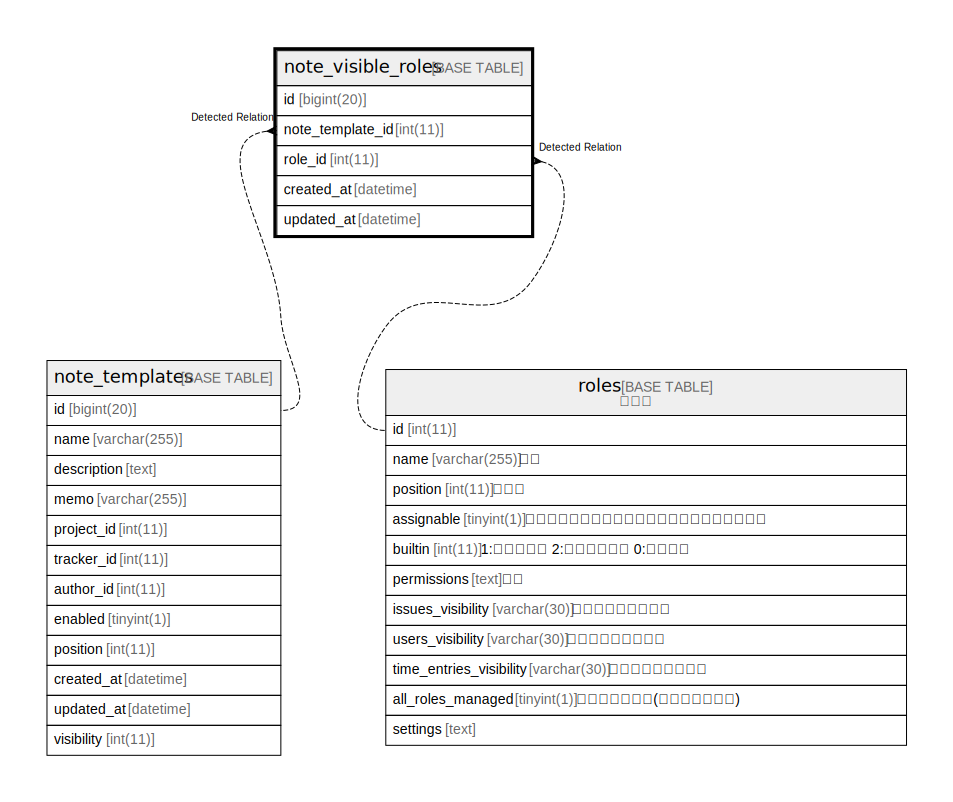

# note_visible_roles

## 概要

<details>
<summary><strong>テーブル定義</strong></summary>

```sql
CREATE TABLE `note_visible_roles` (
  `id` bigint(20) NOT NULL AUTO_INCREMENT,
  `note_template_id` int(11) DEFAULT NULL,
  `role_id` int(11) DEFAULT NULL,
  `created_at` datetime NOT NULL,
  `updated_at` datetime NOT NULL,
  PRIMARY KEY (`id`),
  KEY `index_note_visible_roles_on_note_template_id` (`note_template_id`),
  KEY `index_note_visible_roles_on_role_id` (`role_id`)
) ENGINE=InnoDB DEFAULT CHARSET=utf8mb4 COLLATE=utf8mb4_general_ci
```

</details>

## カラム一覧

| 名前               | タイプ        | デフォルト値       | NULL許可   | Extra Definition | 子テーブル      | 親テーブル                               | コメント     |
| ---------------- | ---------- | ------------ | -------- | ---------------- | ---------- | ----------------------------------- | -------- |
| id               | bigint(20) |              | false    | auto_increment   |            |                                     |          |
| note_template_id | int(11)    | NULL         | true     |                  |            | [note_templates](note_templates.md) |          |
| role_id          | int(11)    | NULL         | true     |                  |            | [roles](roles.md)                   |          |
| created_at       | datetime   |              | false    |                  |            |                                     |          |
| updated_at       | datetime   |              | false    |                  |            |                                     |          |

## 制約一覧

| 名前      | タイプ         | 定義               |
| ------- | ----------- | ---------------- |
| PRIMARY | PRIMARY KEY | PRIMARY KEY (id) |

## INDEX一覧

| 名前                                           | 定義                                                                              |
| -------------------------------------------- | ------------------------------------------------------------------------------- |
| index_note_visible_roles_on_note_template_id | KEY index_note_visible_roles_on_note_template_id (note_template_id) USING BTREE |
| index_note_visible_roles_on_role_id          | KEY index_note_visible_roles_on_role_id (role_id) USING BTREE                   |
| PRIMARY                                      | PRIMARY KEY (id) USING BTREE                                                    |

## ER図



---

> Generated by [tbls](https://github.com/k1LoW/tbls)
