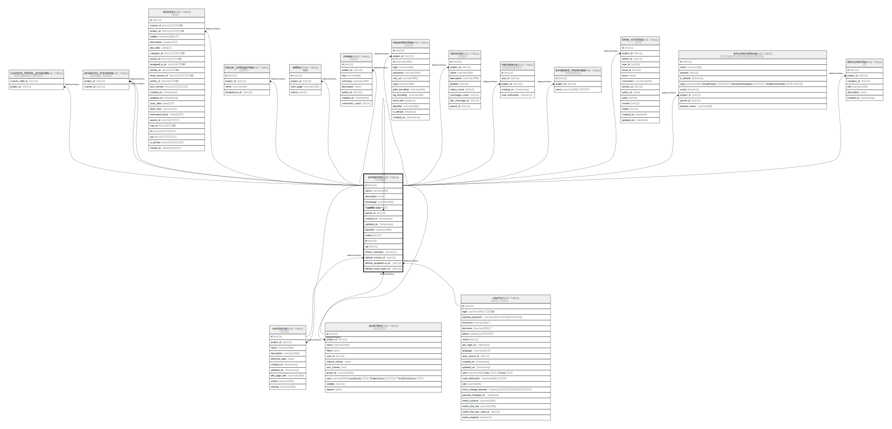

# projects

## Description

<details>
<summary><strong>Table Definition</strong></summary>

```sql
CREATE TABLE `projects` (
  `id` int(11) NOT NULL AUTO_INCREMENT,
  `name` varchar(255) NOT NULL DEFAULT '',
  `description` text DEFAULT NULL,
  `homepage` varchar(255) DEFAULT '',
  `is_public` tinyint(1) NOT NULL DEFAULT 1,
  `parent_id` int(11) DEFAULT NULL,
  `created_on` timestamp NULL DEFAULT NULL,
  `updated_on` timestamp NULL DEFAULT NULL,
  `identifier` varchar(255) DEFAULT NULL,
  `status` int(11) NOT NULL DEFAULT 1,
  `lft` int(11) DEFAULT NULL,
  `rgt` int(11) DEFAULT NULL,
  `inherit_members` tinyint(1) NOT NULL DEFAULT 0,
  `default_version_id` int(11) DEFAULT NULL,
  `default_assigned_to_id` int(11) DEFAULT NULL,
  `default_issue_query_id` int(11) DEFAULT NULL,
  PRIMARY KEY (`id`),
  KEY `index_projects_on_lft` (`lft`),
  KEY `index_projects_on_rgt` (`rgt`)
) ENGINE=InnoDB DEFAULT CHARSET=utf8mb4 COLLATE=utf8mb4_general_ci
```

</details>

## Columns

| Name | Type | Default | Nullable | Extra Definition | Children | Parents | Comment |
| ---- | ---- | ------- | -------- | ---------------- | -------- | ------- | ------- |
| id | int(11) |  | false | auto_increment |  |  |  |
| name | varchar(255) | '' | false |  |  |  |  |
| description | text | NULL | true |  |  |  |  |
| homepage | varchar(255) | '' | true |  |  |  |  |
| is_public | tinyint(1) | 1 | false |  |  |  |  |
| parent_id | int(11) | NULL | true |  |  |  |  |
| created_on | timestamp | NULL | true |  |  |  |  |
| updated_on | timestamp | NULL | true |  |  |  |  |
| identifier | varchar(255) | NULL | true |  |  |  |  |
| status | int(11) | 1 | false |  |  |  |  |
| lft | int(11) | NULL | true |  |  |  |  |
| rgt | int(11) | NULL | true |  |  |  |  |
| inherit_members | tinyint(1) | 0 | false |  |  |  |  |
| default_version_id | int(11) | NULL | true |  |  |  |  |
| default_assigned_to_id | int(11) | NULL | true |  |  |  |  |
| default_issue_query_id | int(11) | NULL | true |  |  |  |  |

## Constraints

| Name | Type | Definition |
| ---- | ---- | ---------- |
| PRIMARY | PRIMARY KEY | PRIMARY KEY (id) |

## Indexes

| Name | Definition |
| ---- | ---------- |
| index_projects_on_lft | KEY index_projects_on_lft (lft) USING BTREE |
| index_projects_on_rgt | KEY index_projects_on_rgt (rgt) USING BTREE |
| PRIMARY | PRIMARY KEY (id) USING BTREE |

## Relations



---

> Generated by [tbls](https://github.com/k1LoW/tbls)
