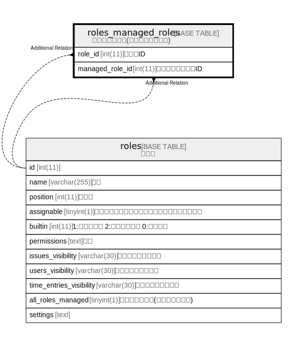

# roles_managed_roles

## Description

<details>
<summary><strong>Table Definition</strong></summary>

```sql
CREATE TABLE `roles_managed_roles` (
  `role_id` int(11) NOT NULL,
  `managed_role_id` int(11) NOT NULL,
  UNIQUE KEY `index_roles_managed_roles_on_role_id_and_managed_role_id` (`role_id`,`managed_role_id`)
) ENGINE=InnoDB DEFAULT CHARSET=utf8mb4 COLLATE=utf8mb4_general_ci
```

</details>

## Columns

| Name | Type | Default | Nullable | Children | Parents | Comment |
| ---- | ---- | ------- | -------- | -------- | ------- | ------- |
| role_id | int(11) |  | false |  |  |  |
| managed_role_id | int(11) |  | false |  |  |  |

## Constraints

| Name | Type | Definition |
| ---- | ---- | ---------- |
| index_roles_managed_roles_on_role_id_and_managed_role_id | UNIQUE | UNIQUE KEY index_roles_managed_roles_on_role_id_and_managed_role_id (role_id, managed_role_id) |

## Indexes

| Name | Definition |
| ---- | ---------- |
| index_roles_managed_roles_on_role_id_and_managed_role_id | UNIQUE KEY index_roles_managed_roles_on_role_id_and_managed_role_id (role_id, managed_role_id) USING BTREE |

## Relations



---

> Generated by [tbls](https://github.com/k1LoW/tbls)
