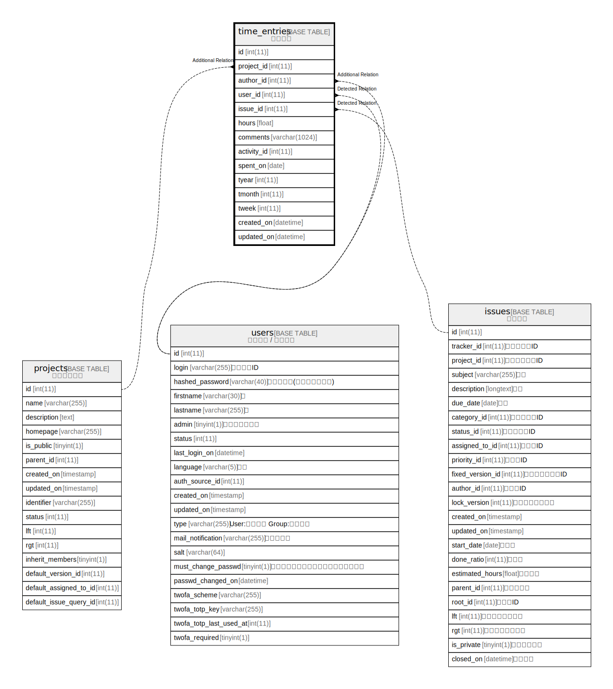

# time_entries

## Description

<details>
<summary><strong>Table Definition</strong></summary>

```sql
CREATE TABLE `time_entries` (
  `id` int(11) NOT NULL AUTO_INCREMENT,
  `project_id` int(11) NOT NULL,
  `author_id` int(11) DEFAULT NULL,
  `user_id` int(11) NOT NULL,
  `issue_id` int(11) DEFAULT NULL,
  `hours` float NOT NULL,
  `comments` varchar(1024) DEFAULT NULL,
  `activity_id` int(11) NOT NULL,
  `spent_on` date NOT NULL,
  `tyear` int(11) NOT NULL,
  `tmonth` int(11) NOT NULL,
  `tweek` int(11) NOT NULL,
  `created_on` datetime NOT NULL,
  `updated_on` datetime NOT NULL,
  PRIMARY KEY (`id`),
  KEY `time_entries_project_id` (`project_id`),
  KEY `time_entries_issue_id` (`issue_id`),
  KEY `index_time_entries_on_activity_id` (`activity_id`),
  KEY `index_time_entries_on_user_id` (`user_id`),
  KEY `index_time_entries_on_created_on` (`created_on`)
) ENGINE=InnoDB DEFAULT CHARSET=utf8mb4 COLLATE=utf8mb4_general_ci
```

</details>

## Columns

| Name | Type | Default | Nullable | Extra Definition | Children | Parents | Comment |
| ---- | ---- | ------- | -------- | ---------------- | -------- | ------- | ------- |
| id | int(11) |  | false | auto_increment |  |  |  |
| project_id | int(11) |  | false |  |  |  |  |
| author_id | int(11) | NULL | true |  |  |  |  |
| user_id | int(11) |  | false |  |  |  |  |
| issue_id | int(11) | NULL | true |  |  |  |  |
| hours | float |  | false |  |  |  |  |
| comments | varchar(1024) | NULL | true |  |  |  |  |
| activity_id | int(11) |  | false |  |  |  |  |
| spent_on | date |  | false |  |  |  |  |
| tyear | int(11) |  | false |  |  |  |  |
| tmonth | int(11) |  | false |  |  |  |  |
| tweek | int(11) |  | false |  |  |  |  |
| created_on | datetime |  | false |  |  |  |  |
| updated_on | datetime |  | false |  |  |  |  |

## Constraints

| Name | Type | Definition |
| ---- | ---- | ---------- |
| PRIMARY | PRIMARY KEY | PRIMARY KEY (id) |

## Indexes

| Name | Definition |
| ---- | ---------- |
| index_time_entries_on_activity_id | KEY index_time_entries_on_activity_id (activity_id) USING BTREE |
| index_time_entries_on_created_on | KEY index_time_entries_on_created_on (created_on) USING BTREE |
| index_time_entries_on_user_id | KEY index_time_entries_on_user_id (user_id) USING BTREE |
| time_entries_issue_id | KEY time_entries_issue_id (issue_id) USING BTREE |
| time_entries_project_id | KEY time_entries_project_id (project_id) USING BTREE |
| PRIMARY | PRIMARY KEY (id) USING BTREE |

## Relations



---

> Generated by [tbls](https://github.com/k1LoW/tbls)
