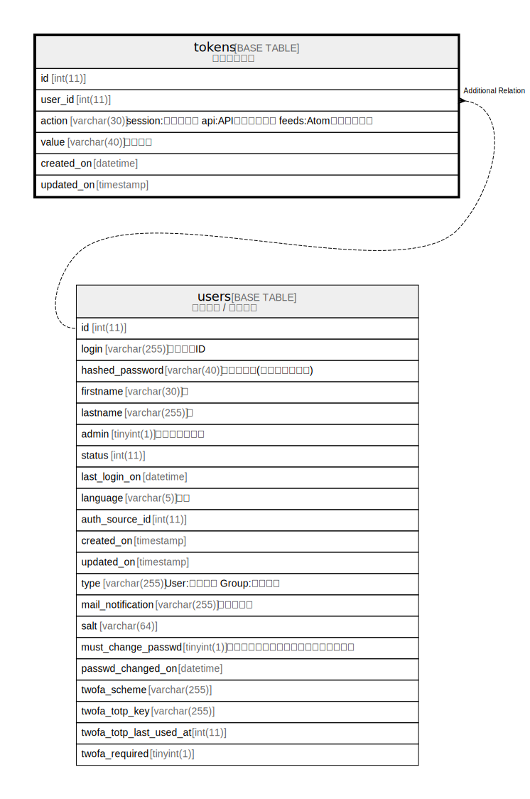

# tokens

## Description

<details>
<summary><strong>Table Definition</strong></summary>

```sql
CREATE TABLE `tokens` (
  `id` int(11) NOT NULL AUTO_INCREMENT,
  `user_id` int(11) NOT NULL DEFAULT 0,
  `action` varchar(30) NOT NULL DEFAULT '',
  `value` varchar(40) NOT NULL DEFAULT '',
  `created_on` datetime NOT NULL,
  `updated_on` timestamp NULL DEFAULT NULL,
  PRIMARY KEY (`id`),
  UNIQUE KEY `tokens_value` (`value`),
  KEY `index_tokens_on_user_id` (`user_id`)
) ENGINE=InnoDB DEFAULT CHARSET=utf8mb4 COLLATE=utf8mb4_general_ci
```

</details>

## Columns

| Name | Type | Default | Nullable | Extra Definition | Children | Parents | Comment |
| ---- | ---- | ------- | -------- | ---------------- | -------- | ------- | ------- |
| id | int(11) |  | false | auto_increment |  |  |  |
| user_id | int(11) | 0 | false |  |  |  |  |
| action | varchar(30) | '' | false |  |  |  |  |
| value | varchar(40) | '' | false |  |  |  |  |
| created_on | datetime |  | false |  |  |  |  |
| updated_on | timestamp | NULL | true |  |  |  |  |

## Constraints

| Name | Type | Definition |
| ---- | ---- | ---------- |
| PRIMARY | PRIMARY KEY | PRIMARY KEY (id) |
| tokens_value | UNIQUE | UNIQUE KEY tokens_value (value) |

## Indexes

| Name | Definition |
| ---- | ---------- |
| index_tokens_on_user_id | KEY index_tokens_on_user_id (user_id) USING BTREE |
| PRIMARY | PRIMARY KEY (id) USING BTREE |
| tokens_value | UNIQUE KEY tokens_value (value) USING BTREE |

## Relations



---

> Generated by [tbls](https://github.com/k1LoW/tbls)
