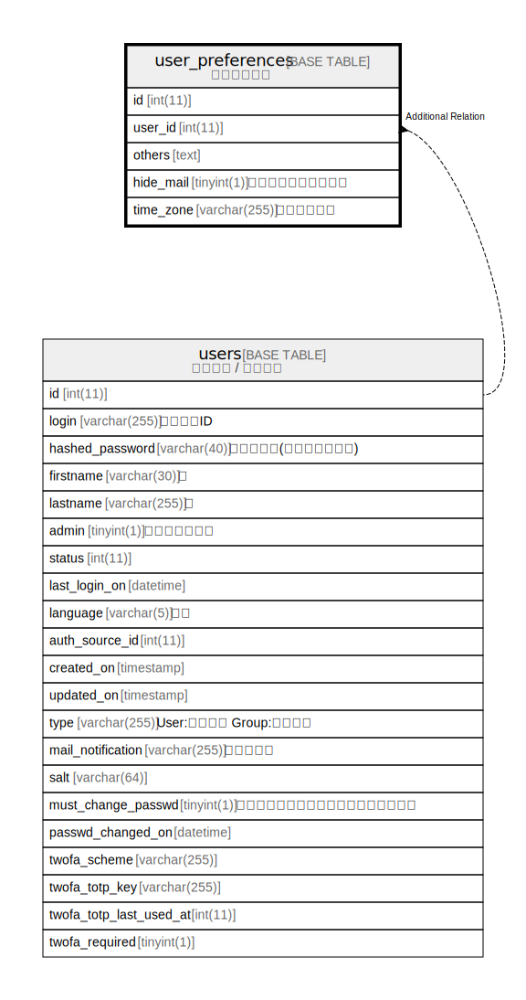

# user_preferences

## Description

<details>
<summary><strong>Table Definition</strong></summary>

```sql
CREATE TABLE `user_preferences` (
  `id` int(11) NOT NULL AUTO_INCREMENT,
  `user_id` int(11) NOT NULL DEFAULT 0,
  `others` text DEFAULT NULL,
  `hide_mail` tinyint(1) DEFAULT 1,
  `time_zone` varchar(255) DEFAULT NULL,
  PRIMARY KEY (`id`),
  KEY `index_user_preferences_on_user_id` (`user_id`)
) ENGINE=InnoDB DEFAULT CHARSET=utf8mb4 COLLATE=utf8mb4_general_ci
```

</details>

## Columns

| Name | Type | Default | Nullable | Extra Definition | Children | Parents | Comment |
| ---- | ---- | ------- | -------- | ---------------- | -------- | ------- | ------- |
| id | int(11) |  | false | auto_increment |  |  |  |
| user_id | int(11) | 0 | false |  |  |  |  |
| others | text | NULL | true |  |  |  |  |
| hide_mail | tinyint(1) | 1 | true |  |  |  |  |
| time_zone | varchar(255) | NULL | true |  |  |  |  |

## Constraints

| Name | Type | Definition |
| ---- | ---- | ---------- |
| PRIMARY | PRIMARY KEY | PRIMARY KEY (id) |

## Indexes

| Name | Definition |
| ---- | ---------- |
| index_user_preferences_on_user_id | KEY index_user_preferences_on_user_id (user_id) USING BTREE |
| PRIMARY | PRIMARY KEY (id) USING BTREE |

## Relations



---

> Generated by [tbls](https://github.com/k1LoW/tbls)
