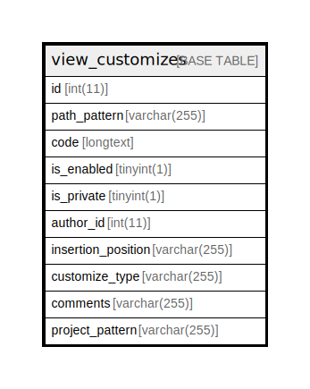

# view_customizes

## Description

<details>
<summary><strong>Table Definition</strong></summary>

```sql
CREATE TABLE `view_customizes` (
  `id` int(11) NOT NULL AUTO_INCREMENT,
  `path_pattern` varchar(255) NOT NULL DEFAULT '',
  `code` longtext NOT NULL,
  `is_enabled` tinyint(1) NOT NULL DEFAULT 1,
  `is_private` tinyint(1) NOT NULL DEFAULT 0,
  `author_id` int(11) NOT NULL DEFAULT 0,
  `insertion_position` varchar(255) NOT NULL DEFAULT 'html_head',
  `customize_type` varchar(255) NOT NULL DEFAULT 'javascript',
  `comments` varchar(255) NOT NULL DEFAULT '',
  `project_pattern` varchar(255) NOT NULL DEFAULT '',
  PRIMARY KEY (`id`)
) ENGINE=InnoDB DEFAULT CHARSET=utf8mb4 COLLATE=utf8mb4_general_ci
```

</details>

## Columns

| Name | Type | Default | Nullable | Extra Definition | Children | Parents | Comment |
| ---- | ---- | ------- | -------- | ---------------- | -------- | ------- | ------- |
| id | int(11) |  | false | auto_increment |  |  |  |
| path_pattern | varchar(255) | '' | false |  |  |  |  |
| code | longtext |  | false |  |  |  |  |
| is_enabled | tinyint(1) | 1 | false |  |  |  |  |
| is_private | tinyint(1) | 0 | false |  |  |  |  |
| author_id | int(11) | 0 | false |  |  |  |  |
| insertion_position | varchar(255) | 'html_head' | false |  |  |  |  |
| customize_type | varchar(255) | 'javascript' | false |  |  |  |  |
| comments | varchar(255) | '' | false |  |  |  |  |
| project_pattern | varchar(255) | '' | false |  |  |  |  |

## Constraints

| Name | Type | Definition |
| ---- | ---- | ---------- |
| PRIMARY | PRIMARY KEY | PRIMARY KEY (id) |

## Indexes

| Name | Definition |
| ---- | ---------- |
| PRIMARY | PRIMARY KEY (id) USING BTREE |

## Relations



---

> Generated by [tbls](https://github.com/k1LoW/tbls)
