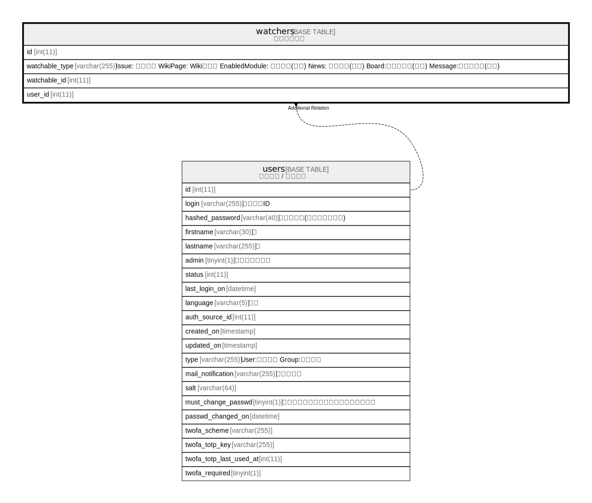

# watchers

## Description

<details>
<summary><strong>Table Definition</strong></summary>

```sql
CREATE TABLE `watchers` (
  `id` int(11) NOT NULL AUTO_INCREMENT,
  `watchable_type` varchar(255) NOT NULL DEFAULT '',
  `watchable_id` int(11) NOT NULL DEFAULT 0,
  `user_id` int(11) DEFAULT NULL,
  PRIMARY KEY (`id`),
  KEY `watchers_user_id_type` (`user_id`,`watchable_type`),
  KEY `index_watchers_on_user_id` (`user_id`),
  KEY `index_watchers_on_watchable_id_and_watchable_type` (`watchable_id`,`watchable_type`)
) ENGINE=InnoDB DEFAULT CHARSET=utf8mb4 COLLATE=utf8mb4_general_ci
```

</details>

## Columns

| Name | Type | Default | Nullable | Extra Definition | Children | Parents | Comment |
| ---- | ---- | ------- | -------- | ---------------- | -------- | ------- | ------- |
| id | int(11) |  | false | auto_increment |  |  |  |
| watchable_type | varchar(255) | '' | false |  |  |  |  |
| watchable_id | int(11) | 0 | false |  |  |  |  |
| user_id | int(11) | NULL | true |  |  |  |  |

## Constraints

| Name | Type | Definition |
| ---- | ---- | ---------- |
| PRIMARY | PRIMARY KEY | PRIMARY KEY (id) |

## Indexes

| Name | Definition |
| ---- | ---------- |
| index_watchers_on_user_id | KEY index_watchers_on_user_id (user_id) USING BTREE |
| index_watchers_on_watchable_id_and_watchable_type | KEY index_watchers_on_watchable_id_and_watchable_type (watchable_id, watchable_type) USING BTREE |
| watchers_user_id_type | KEY watchers_user_id_type (user_id, watchable_type) USING BTREE |
| PRIMARY | PRIMARY KEY (id) USING BTREE |

## Relations



---

> Generated by [tbls](https://github.com/k1LoW/tbls)
