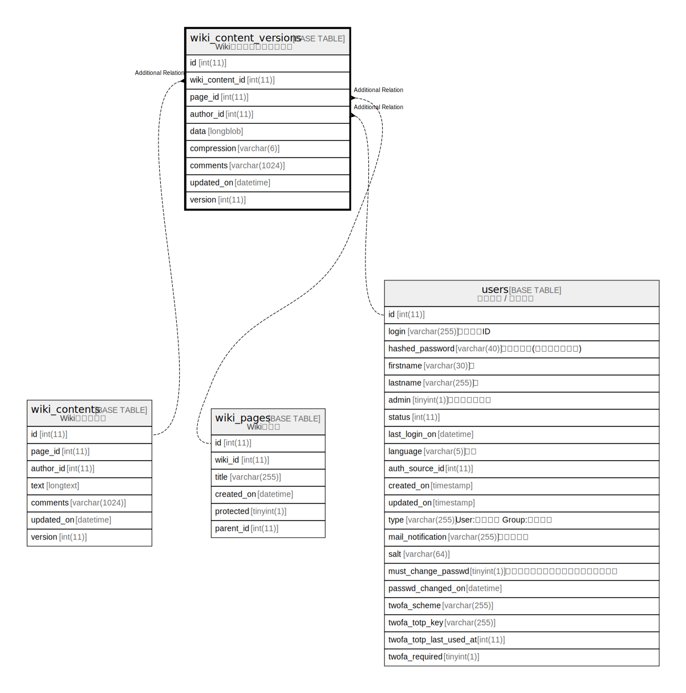

# wiki_content_versions

## Description

<details>
<summary><strong>Table Definition</strong></summary>

```sql
CREATE TABLE `wiki_content_versions` (
  `id` int(11) NOT NULL AUTO_INCREMENT,
  `wiki_content_id` int(11) NOT NULL,
  `page_id` int(11) NOT NULL,
  `author_id` int(11) DEFAULT NULL,
  `data` longblob DEFAULT NULL,
  `compression` varchar(6) DEFAULT '',
  `comments` varchar(1024) DEFAULT '',
  `updated_on` datetime NOT NULL,
  `version` int(11) NOT NULL,
  PRIMARY KEY (`id`),
  KEY `wiki_content_versions_wcid` (`wiki_content_id`),
  KEY `index_wiki_content_versions_on_updated_on` (`updated_on`)
) ENGINE=InnoDB DEFAULT CHARSET=utf8mb4 COLLATE=utf8mb4_general_ci
```

</details>

## Columns

| Name | Type | Default | Nullable | Extra Definition | Children | Parents | Comment |
| ---- | ---- | ------- | -------- | ---------------- | -------- | ------- | ------- |
| id | int(11) |  | false | auto_increment |  |  |  |
| wiki_content_id | int(11) |  | false |  |  |  |  |
| page_id | int(11) |  | false |  |  |  |  |
| author_id | int(11) | NULL | true |  |  |  |  |
| data | longblob | NULL | true |  |  |  |  |
| compression | varchar(6) | '' | true |  |  |  |  |
| comments | varchar(1024) | '' | true |  |  |  |  |
| updated_on | datetime |  | false |  |  |  |  |
| version | int(11) |  | false |  |  |  |  |

## Constraints

| Name | Type | Definition |
| ---- | ---- | ---------- |
| PRIMARY | PRIMARY KEY | PRIMARY KEY (id) |

## Indexes

| Name | Definition |
| ---- | ---------- |
| index_wiki_content_versions_on_updated_on | KEY index_wiki_content_versions_on_updated_on (updated_on) USING BTREE |
| wiki_content_versions_wcid | KEY wiki_content_versions_wcid (wiki_content_id) USING BTREE |
| PRIMARY | PRIMARY KEY (id) USING BTREE |

## Relations



---

> Generated by [tbls](https://github.com/k1LoW/tbls)
