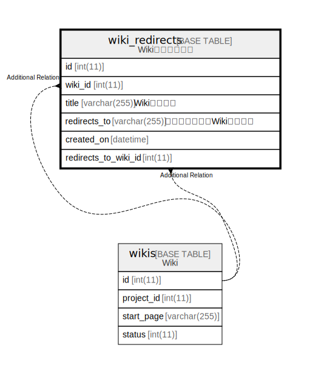

# wiki_redirects

## Description

<details>
<summary><strong>Table Definition</strong></summary>

```sql
CREATE TABLE `wiki_redirects` (
  `id` int(11) NOT NULL AUTO_INCREMENT,
  `wiki_id` int(11) NOT NULL,
  `title` varchar(255) DEFAULT NULL,
  `redirects_to` varchar(255) DEFAULT NULL,
  `created_on` datetime NOT NULL,
  `redirects_to_wiki_id` int(11) NOT NULL,
  PRIMARY KEY (`id`),
  KEY `wiki_redirects_wiki_id_title` (`wiki_id`,`title`),
  KEY `index_wiki_redirects_on_wiki_id` (`wiki_id`)
) ENGINE=InnoDB DEFAULT CHARSET=utf8mb4 COLLATE=utf8mb4_general_ci
```

</details>

## Columns

| Name | Type | Default | Nullable | Extra Definition | Children | Parents | Comment |
| ---- | ---- | ------- | -------- | ---------------- | -------- | ------- | ------- |
| id | int(11) |  | false | auto_increment |  |  |  |
| wiki_id | int(11) |  | false |  |  |  |  |
| title | varchar(255) | NULL | true |  |  |  |  |
| redirects_to | varchar(255) | NULL | true |  |  |  |  |
| created_on | datetime |  | false |  |  |  |  |
| redirects_to_wiki_id | int(11) |  | false |  |  |  |  |

## Constraints

| Name | Type | Definition |
| ---- | ---- | ---------- |
| PRIMARY | PRIMARY KEY | PRIMARY KEY (id) |

## Indexes

| Name | Definition |
| ---- | ---------- |
| index_wiki_redirects_on_wiki_id | KEY index_wiki_redirects_on_wiki_id (wiki_id) USING BTREE |
| wiki_redirects_wiki_id_title | KEY wiki_redirects_wiki_id_title (wiki_id, title) USING BTREE |
| PRIMARY | PRIMARY KEY (id) USING BTREE |

## Relations



---

> Generated by [tbls](https://github.com/k1LoW/tbls)
