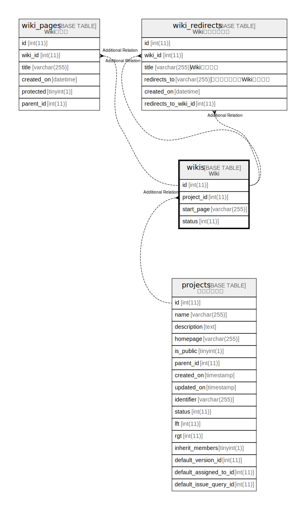

# wikis

## Description

<details>
<summary><strong>Table Definition</strong></summary>

```sql
CREATE TABLE `wikis` (
  `id` int(11) NOT NULL AUTO_INCREMENT,
  `project_id` int(11) NOT NULL,
  `start_page` varchar(255) NOT NULL,
  `status` int(11) NOT NULL DEFAULT 1,
  PRIMARY KEY (`id`),
  KEY `wikis_project_id` (`project_id`)
) ENGINE=InnoDB DEFAULT CHARSET=utf8mb4 COLLATE=utf8mb4_general_ci
```

</details>

## Columns

| Name | Type | Default | Nullable | Extra Definition | Children | Parents | Comment |
| ---- | ---- | ------- | -------- | ---------------- | -------- | ------- | ------- |
| id | int(11) |  | false | auto_increment |  |  |  |
| project_id | int(11) |  | false |  |  |  |  |
| start_page | varchar(255) |  | false |  |  |  |  |
| status | int(11) | 1 | false |  |  |  |  |

## Constraints

| Name | Type | Definition |
| ---- | ---- | ---------- |
| PRIMARY | PRIMARY KEY | PRIMARY KEY (id) |

## Indexes

| Name | Definition |
| ---- | ---------- |
| wikis_project_id | KEY wikis_project_id (project_id) USING BTREE |
| PRIMARY | PRIMARY KEY (id) USING BTREE |

## Relations



---

> Generated by [tbls](https://github.com/k1LoW/tbls)
