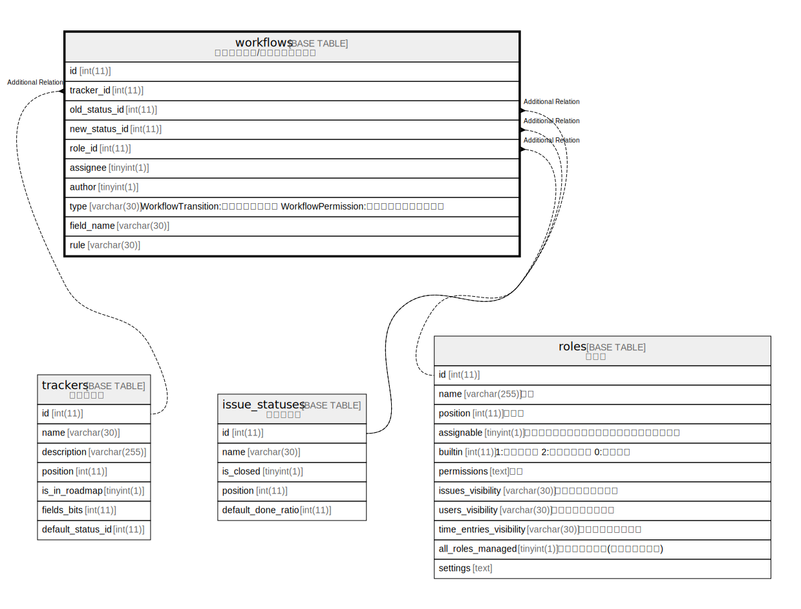

# workflows

## Description

<details>
<summary><strong>Table Definition</strong></summary>

```sql
CREATE TABLE `workflows` (
  `id` int(11) NOT NULL AUTO_INCREMENT,
  `tracker_id` int(11) NOT NULL DEFAULT 0,
  `old_status_id` int(11) NOT NULL DEFAULT 0,
  `new_status_id` int(11) NOT NULL DEFAULT 0,
  `role_id` int(11) NOT NULL DEFAULT 0,
  `assignee` tinyint(1) NOT NULL DEFAULT 0,
  `author` tinyint(1) NOT NULL DEFAULT 0,
  `type` varchar(30) DEFAULT NULL,
  `field_name` varchar(30) DEFAULT NULL,
  `rule` varchar(30) DEFAULT NULL,
  PRIMARY KEY (`id`),
  KEY `wkfs_role_tracker_old_status` (`role_id`,`tracker_id`,`old_status_id`),
  KEY `index_workflows_on_old_status_id` (`old_status_id`),
  KEY `index_workflows_on_role_id` (`role_id`),
  KEY `index_workflows_on_new_status_id` (`new_status_id`),
  KEY `index_workflows_on_tracker_id` (`tracker_id`)
) ENGINE=InnoDB AUTO_INCREMENT=[Redacted by tbls] DEFAULT CHARSET=utf8mb4 COLLATE=utf8mb4_general_ci
```

</details>

## Columns

| Name | Type | Default | Nullable | Extra Definition | Children | Parents | Comment |
| ---- | ---- | ------- | -------- | ---------------- | -------- | ------- | ------- |
| id | int(11) |  | false | auto_increment |  |  |  |
| tracker_id | int(11) | 0 | false |  |  |  |  |
| old_status_id | int(11) | 0 | false |  |  |  |  |
| new_status_id | int(11) | 0 | false |  |  |  |  |
| role_id | int(11) | 0 | false |  |  |  |  |
| assignee | tinyint(1) | 0 | false |  |  |  |  |
| author | tinyint(1) | 0 | false |  |  |  |  |
| type | varchar(30) | NULL | true |  |  |  |  |
| field_name | varchar(30) | NULL | true |  |  |  |  |
| rule | varchar(30) | NULL | true |  |  |  |  |

## Constraints

| Name | Type | Definition |
| ---- | ---- | ---------- |
| PRIMARY | PRIMARY KEY | PRIMARY KEY (id) |

## Indexes

| Name | Definition |
| ---- | ---------- |
| index_workflows_on_new_status_id | KEY index_workflows_on_new_status_id (new_status_id) USING BTREE |
| index_workflows_on_old_status_id | KEY index_workflows_on_old_status_id (old_status_id) USING BTREE |
| index_workflows_on_role_id | KEY index_workflows_on_role_id (role_id) USING BTREE |
| index_workflows_on_tracker_id | KEY index_workflows_on_tracker_id (tracker_id) USING BTREE |
| wkfs_role_tracker_old_status | KEY wkfs_role_tracker_old_status (role_id, tracker_id, old_status_id) USING BTREE |
| PRIMARY | PRIMARY KEY (id) USING BTREE |

## Relations



---

> Generated by [tbls](https://github.com/k1LoW/tbls)
