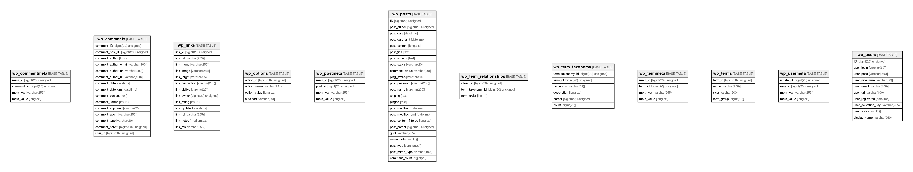

[WordPress](https://ja.wordpress.org/)
===============

## Tables

| Name                                              | Columns | Comment | Type       |
| ------------------------------------------------- | ------- | ------- | ---------- |
| [wp_commentmeta](wp_commentmeta.md)               | 4       |         | BASE TABLE |
| [wp_comments](wp_comments.md)                     | 15      |         | BASE TABLE |
| [wp_links](wp_links.md)                           | 13      |         | BASE TABLE |
| [wp_options](wp_options.md)                       | 4       |         | BASE TABLE |
| [wp_postmeta](wp_postmeta.md)                     | 4       |         | BASE TABLE |
| [wp_posts](wp_posts.md)                           | 23      |         | BASE TABLE |
| [wp_term_relationships](wp_term_relationships.md) | 3       |         | BASE TABLE |
| [wp_term_taxonomy](wp_term_taxonomy.md)           | 6       |         | BASE TABLE |
| [wp_termmeta](wp_termmeta.md)                     | 4       |         | BASE TABLE |
| [wp_terms](wp_terms.md)                           | 4       |         | BASE TABLE |
| [wp_usermeta](wp_usermeta.md)                     | 4       |         | BASE TABLE |
| [wp_users](wp_users.md)                           | 10      |         | BASE TABLE |

## Relations

---

> Generated by [tbls](https://github.com/k1LoW/tbls)
