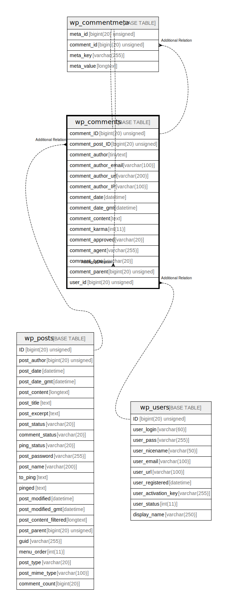

# wp_comments

## 概要

<details>
<summary><strong>テーブル定義</strong></summary>

```sql
CREATE TABLE `wp_comments` (
  `comment_ID` bigint(20) unsigned NOT NULL AUTO_INCREMENT,
  `comment_post_ID` bigint(20) unsigned NOT NULL DEFAULT 0,
  `comment_author` tinytext NOT NULL,
  `comment_author_email` varchar(100) NOT NULL DEFAULT '',
  `comment_author_url` varchar(200) NOT NULL DEFAULT '',
  `comment_author_IP` varchar(100) NOT NULL DEFAULT '',
  `comment_date` datetime NOT NULL DEFAULT '0000-00-00 00:00:00',
  `comment_date_gmt` datetime NOT NULL DEFAULT '0000-00-00 00:00:00',
  `comment_content` text NOT NULL,
  `comment_karma` int(11) NOT NULL DEFAULT 0,
  `comment_approved` varchar(20) NOT NULL DEFAULT '1',
  `comment_agent` varchar(255) NOT NULL DEFAULT '',
  `comment_type` varchar(20) NOT NULL DEFAULT 'comment',
  `comment_parent` bigint(20) unsigned NOT NULL DEFAULT 0,
  `user_id` bigint(20) unsigned NOT NULL DEFAULT 0,
  PRIMARY KEY (`comment_ID`),
  KEY `comment_post_ID` (`comment_post_ID`),
  KEY `comment_approved_date_gmt` (`comment_approved`,`comment_date_gmt`),
  KEY `comment_date_gmt` (`comment_date_gmt`),
  KEY `comment_parent` (`comment_parent`),
  KEY `comment_author_email` (`comment_author_email`(10))
) ENGINE=InnoDB AUTO_INCREMENT=[Redacted by tbls] DEFAULT CHARSET=utf8mb4 COLLATE=utf8mb4_unicode_520_ci
```

</details>

## カラム一覧

| 名前                   | タイプ                 | デフォルト値                | NULL許可   | Extra Definition | 子テーブル                                                             | 親テーブル                         | コメント     |
| -------------------- | ------------------- | --------------------- | -------- | ---------------- | ----------------------------------------------------------------- | ----------------------------- | -------- |
| comment_ID           | bigint(20) unsigned |                       | false    | auto_increment   | [wp_comments](wp_comments.md) [wp_commentmeta](wp_commentmeta.md) |                               |          |
| comment_post_ID      | bigint(20) unsigned | 0                     | false    |                  |                                                                   | [wp_posts](wp_posts.md)       |          |
| comment_author       | tinytext            |                       | false    |                  |                                                                   |                               |          |
| comment_author_email | varchar(100)        | ''                    | false    |                  |                                                                   |                               |          |
| comment_author_url   | varchar(200)        | ''                    | false    |                  |                                                                   |                               |          |
| comment_author_IP    | varchar(100)        | ''                    | false    |                  |                                                                   |                               |          |
| comment_date         | datetime            | '0000-00-00 00:00:00' | false    |                  |                                                                   |                               |          |
| comment_date_gmt     | datetime            | '0000-00-00 00:00:00' | false    |                  |                                                                   |                               |          |
| comment_content      | text                |                       | false    |                  |                                                                   |                               |          |
| comment_karma        | int(11)             | 0                     | false    |                  |                                                                   |                               |          |
| comment_approved     | varchar(20)         | '1'                   | false    |                  |                                                                   |                               |          |
| comment_agent        | varchar(255)        | ''                    | false    |                  |                                                                   |                               |          |
| comment_type         | varchar(20)         | 'comment'             | false    |                  |                                                                   |                               |          |
| comment_parent       | bigint(20) unsigned | 0                     | false    |                  |                                                                   | [wp_comments](wp_comments.md) |          |
| user_id              | bigint(20) unsigned | 0                     | false    |                  |                                                                   | [wp_users](wp_users.md)       |          |

## 制約一覧

| 名前      | タイプ         | 定義                       |
| ------- | ----------- | ------------------------ |
| PRIMARY | PRIMARY KEY | PRIMARY KEY (comment_ID) |

## INDEX一覧

| 名前                        | 定義                                                                             |
| ------------------------- | ------------------------------------------------------------------------------ |
| comment_approved_date_gmt | KEY comment_approved_date_gmt (comment_approved, comment_date_gmt) USING BTREE |
| comment_author_email      | KEY comment_author_email (comment_author_email) USING BTREE                    |
| comment_date_gmt          | KEY comment_date_gmt (comment_date_gmt) USING BTREE                            |
| comment_parent            | KEY comment_parent (comment_parent) USING BTREE                                |
| comment_post_ID           | KEY comment_post_ID (comment_post_ID) USING BTREE                              |
| PRIMARY                   | PRIMARY KEY (comment_ID) USING BTREE                                           |

## ER図



---

> Generated by [tbls](https://github.com/k1LoW/tbls)
