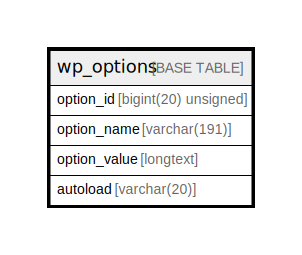

# wp_options

## 概要

<details>
<summary><strong>テーブル定義</strong></summary>

```sql
CREATE TABLE `wp_options` (
  `option_id` bigint(20) unsigned NOT NULL AUTO_INCREMENT,
  `option_name` varchar(191) COLLATE utf8mb4_unicode_520_ci NOT NULL DEFAULT '',
  `option_value` longtext COLLATE utf8mb4_unicode_520_ci NOT NULL,
  `autoload` varchar(20) COLLATE utf8mb4_unicode_520_ci NOT NULL DEFAULT 'yes',
  PRIMARY KEY (`option_id`),
  UNIQUE KEY `option_name` (`option_name`),
  KEY `autoload` (`autoload`)
) ENGINE=InnoDB AUTO_INCREMENT=[Redacted by tbls] DEFAULT CHARSET=utf8mb4 COLLATE=utf8mb4_unicode_520_ci
```

</details>

## カラム一覧

| 名前           | タイプ                 | デフォルト値       | NULL許可   | Extra Definition | 子テーブル      | 親テーブル      | コメント     |
| ------------ | ------------------- | ------------ | -------- | ---------------- | ---------- | ---------- | -------- |
| option_id    | bigint(20) unsigned |              | false    | auto_increment   |            |            |          |
| option_name  | varchar(191)        | ''           | false    |                  |            |            |          |
| option_value | longtext            |              | false    |                  |            |            |          |
| autoload     | varchar(20)         | 'yes'        | false    |                  |            |            |          |

## 制約一覧

| 名前          | タイプ         | 定義                                   |
| ----------- | ----------- | ------------------------------------ |
| option_name | UNIQUE      | UNIQUE KEY option_name (option_name) |
| PRIMARY     | PRIMARY KEY | PRIMARY KEY (option_id)              |

## INDEX一覧

| 名前          | 定義                                               |
| ----------- | ------------------------------------------------ |
| autoload    | KEY autoload (autoload) USING BTREE              |
| PRIMARY     | PRIMARY KEY (option_id) USING BTREE              |
| option_name | UNIQUE KEY option_name (option_name) USING BTREE |

## ER図



---

> Generated by [tbls](https://github.com/k1LoW/tbls)
