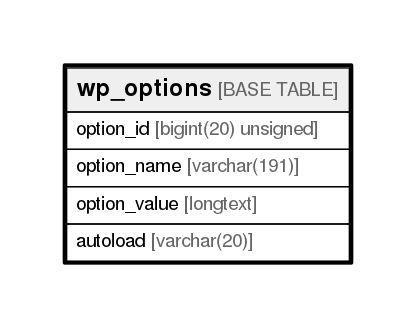

# wp_options

## Description

<details>
<summary><strong>Table Definition</strong></summary>

```sql
CREATE TABLE `wp_options` (
  `option_id` bigint(20) unsigned NOT NULL AUTO_INCREMENT,
  `option_name` varchar(191) COLLATE utf8mb4_unicode_ci NOT NULL DEFAULT '',
  `option_value` longtext COLLATE utf8mb4_unicode_ci NOT NULL,
  `autoload` varchar(20) COLLATE utf8mb4_unicode_ci NOT NULL DEFAULT 'yes',
  PRIMARY KEY (`option_id`),
  UNIQUE KEY `option_name` (`option_name`)
) ENGINE=InnoDB AUTO_INCREMENT=128 DEFAULT CHARSET=utf8mb4 COLLATE=utf8mb4_unicode_ci
```

</details>

## Columns

| Name         | Type                | Default | Nullable | Children | Parents | Comment |
| ------------ | ------------------- | ------- | -------- | -------- | ------- | ------- |
| option_id    | bigint(20) unsigned |         | false    |          |         |         |
| option_name  | varchar(191)        |         | false    |          |         |         |
| option_value | longtext            |         | false    |          |         |         |
| autoload     | varchar(20)         | yes     | false    |          |         |         |

## Constraints

| Name        | Type        | Definition                           |
| ----------- | ----------- | ------------------------------------ |
| option_name | UNIQUE      | UNIQUE KEY option_name (option_name) |
| PRIMARY     | PRIMARY KEY | PRIMARY KEY (option_id)              |

## Indexes

| Name        | Definition                                       |
| ----------- | ------------------------------------------------ |
| PRIMARY     | PRIMARY KEY (option_id) USING BTREE              |
| option_name | UNIQUE KEY option_name (option_name) USING BTREE |

## Relations



---

> Generated by [tbls](https://github.com/k1LoW/tbls)
