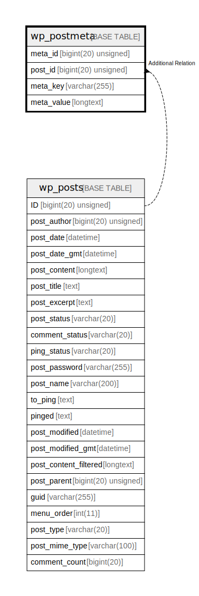

# wp_postmeta

## 概要

<details>
<summary><strong>テーブル定義</strong></summary>

```sql
CREATE TABLE `wp_postmeta` (
  `meta_id` bigint(20) unsigned NOT NULL AUTO_INCREMENT,
  `post_id` bigint(20) unsigned NOT NULL DEFAULT 0,
  `meta_key` varchar(255) COLLATE utf8mb4_unicode_520_ci DEFAULT NULL,
  `meta_value` longtext COLLATE utf8mb4_unicode_520_ci DEFAULT NULL,
  PRIMARY KEY (`meta_id`),
  KEY `post_id` (`post_id`),
  KEY `meta_key` (`meta_key`(191))
) ENGINE=InnoDB AUTO_INCREMENT=[Redacted by tbls] DEFAULT CHARSET=utf8mb4 COLLATE=utf8mb4_unicode_520_ci
```

</details>

## カラム一覧

| 名前         | タイプ                 | デフォルト値       | NULL許可   | Extra Definition | 子テーブル      | 親テーブル      | コメント     |
| ---------- | ------------------- | ------------ | -------- | ---------------- | ---------- | ---------- | -------- |
| meta_id    | bigint(20) unsigned |              | false    | auto_increment   |            |            |          |
| post_id    | bigint(20) unsigned | 0            | false    |                  |            |            |          |
| meta_key   | varchar(255)        | NULL         | true     |                  |            |            |          |
| meta_value | longtext            | NULL         | true     |                  |            |            |          |

## 制約一覧

| 名前      | タイプ         | 定義                    |
| ------- | ----------- | --------------------- |
| PRIMARY | PRIMARY KEY | PRIMARY KEY (meta_id) |

## INDEX一覧

| 名前       | 定義                                  |
| -------- | ----------------------------------- |
| meta_key | KEY meta_key (meta_key) USING BTREE |
| post_id  | KEY post_id (post_id) USING BTREE   |
| PRIMARY  | PRIMARY KEY (meta_id) USING BTREE   |

## ER図



---

> Generated by [tbls](https://github.com/k1LoW/tbls)
