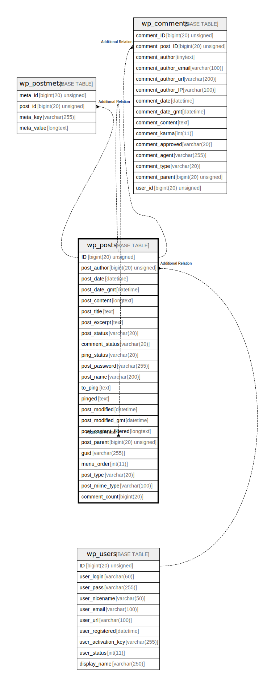

# wp_posts

## 概要

<details>
<summary><strong>テーブル定義</strong></summary>

```sql
CREATE TABLE `wp_posts` (
  `ID` bigint(20) unsigned NOT NULL AUTO_INCREMENT,
  `post_author` bigint(20) unsigned NOT NULL DEFAULT 0,
  `post_date` datetime NOT NULL DEFAULT '0000-00-00 00:00:00',
  `post_date_gmt` datetime NOT NULL DEFAULT '0000-00-00 00:00:00',
  `post_content` longtext NOT NULL,
  `post_title` text NOT NULL,
  `post_excerpt` text NOT NULL,
  `post_status` varchar(20) NOT NULL DEFAULT 'publish',
  `comment_status` varchar(20) NOT NULL DEFAULT 'open',
  `ping_status` varchar(20) NOT NULL DEFAULT 'open',
  `post_password` varchar(255) NOT NULL DEFAULT '',
  `post_name` varchar(200) NOT NULL DEFAULT '',
  `to_ping` text NOT NULL,
  `pinged` text NOT NULL,
  `post_modified` datetime NOT NULL DEFAULT '0000-00-00 00:00:00',
  `post_modified_gmt` datetime NOT NULL DEFAULT '0000-00-00 00:00:00',
  `post_content_filtered` longtext NOT NULL,
  `post_parent` bigint(20) unsigned NOT NULL DEFAULT 0,
  `guid` varchar(255) NOT NULL DEFAULT '',
  `menu_order` int(11) NOT NULL DEFAULT 0,
  `post_type` varchar(20) NOT NULL DEFAULT 'post',
  `post_mime_type` varchar(100) NOT NULL DEFAULT '',
  `comment_count` bigint(20) NOT NULL DEFAULT 0,
  PRIMARY KEY (`ID`),
  KEY `post_name` (`post_name`(191)),
  KEY `type_status_date` (`post_type`,`post_status`,`post_date`,`ID`),
  KEY `post_parent` (`post_parent`),
  KEY `post_author` (`post_author`)
) ENGINE=InnoDB AUTO_INCREMENT=[Redacted by tbls] DEFAULT CHARSET=utf8mb4 COLLATE=utf8mb4_unicode_520_ci
```

</details>

## カラム一覧

| 名前                    | タイプ                 | デフォルト値                | NULL許可   | Extra Definition | 子テーブル                                                                               | 親テーブル                   | コメント     |
| --------------------- | ------------------- | --------------------- | -------- | ---------------- | ----------------------------------------------------------------------------------- | ----------------------- | -------- |
| ID                    | bigint(20) unsigned |                       | false    | auto_increment   | [wp_posts](wp_posts.md) [wp_postmeta](wp_postmeta.md) [wp_comments](wp_comments.md) |                         |          |
| post_author           | bigint(20) unsigned | 0                     | false    |                  |                                                                                     | [wp_users](wp_users.md) |          |
| post_date             | datetime            | '0000-00-00 00:00:00' | false    |                  |                                                                                     |                         |          |
| post_date_gmt         | datetime            | '0000-00-00 00:00:00' | false    |                  |                                                                                     |                         |          |
| post_content          | longtext            |                       | false    |                  |                                                                                     |                         |          |
| post_title            | text                |                       | false    |                  |                                                                                     |                         |          |
| post_excerpt          | text                |                       | false    |                  |                                                                                     |                         |          |
| post_status           | varchar(20)         | 'publish'             | false    |                  |                                                                                     |                         |          |
| comment_status        | varchar(20)         | 'open'                | false    |                  |                                                                                     |                         |          |
| ping_status           | varchar(20)         | 'open'                | false    |                  |                                                                                     |                         |          |
| post_password         | varchar(255)        | ''                    | false    |                  |                                                                                     |                         |          |
| post_name             | varchar(200)        | ''                    | false    |                  |                                                                                     |                         |          |
| to_ping               | text                |                       | false    |                  |                                                                                     |                         |          |
| pinged                | text                |                       | false    |                  |                                                                                     |                         |          |
| post_modified         | datetime            | '0000-00-00 00:00:00' | false    |                  |                                                                                     |                         |          |
| post_modified_gmt     | datetime            | '0000-00-00 00:00:00' | false    |                  |                                                                                     |                         |          |
| post_content_filtered | longtext            |                       | false    |                  |                                                                                     |                         |          |
| post_parent           | bigint(20) unsigned | 0                     | false    |                  |                                                                                     | [wp_posts](wp_posts.md) |          |
| guid                  | varchar(255)        | ''                    | false    |                  |                                                                                     |                         |          |
| menu_order            | int(11)             | 0                     | false    |                  |                                                                                     |                         |          |
| post_type             | varchar(20)         | 'post'                | false    |                  |                                                                                     |                         |          |
| post_mime_type        | varchar(100)        | ''                    | false    |                  |                                                                                     |                         |          |
| comment_count         | bigint(20)          | 0                     | false    |                  |                                                                                     |                         |          |

## 制約一覧

| 名前      | タイプ         | 定義               |
| ------- | ----------- | ---------------- |
| PRIMARY | PRIMARY KEY | PRIMARY KEY (ID) |

## INDEX一覧

| 名前               | 定義                                                                       |
| ---------------- | ------------------------------------------------------------------------ |
| post_author      | KEY post_author (post_author) USING BTREE                                |
| post_name        | KEY post_name (post_name) USING BTREE                                    |
| post_parent      | KEY post_parent (post_parent) USING BTREE                                |
| type_status_date | KEY type_status_date (post_type, post_status, post_date, ID) USING BTREE |
| PRIMARY          | PRIMARY KEY (ID) USING BTREE                                             |

## ER図



---

> Generated by [tbls](https://github.com/k1LoW/tbls)
