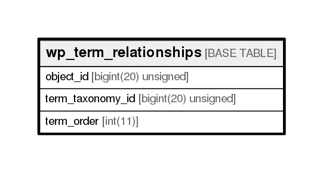

# wp_term_relationships

## Description

<details>
<summary><strong>Table Definition</strong></summary>

```sql
CREATE TABLE `wp_term_relationships` (
  `object_id` bigint(20) unsigned NOT NULL DEFAULT '0',
  `term_taxonomy_id` bigint(20) unsigned NOT NULL DEFAULT '0',
  `term_order` int(11) NOT NULL DEFAULT '0',
  PRIMARY KEY (`object_id`,`term_taxonomy_id`),
  KEY `term_taxonomy_id` (`term_taxonomy_id`)
) ENGINE=InnoDB DEFAULT CHARSET=utf8mb4 COLLATE=utf8mb4_unicode_ci
```

</details>

## Columns

| Name             | Type                | Default | Nullable | Children | Parents | Comment |
| ---------------- | ------------------- | ------- | -------- | -------- | ------- | ------- |
| object_id        | bigint(20) unsigned | 0       | false    |          |         |         |
| term_taxonomy_id | bigint(20) unsigned | 0       | false    |          |         |         |
| term_order       | int(11)             | 0       | false    |          |         |         |

## Constraints

| Name    | Type        | Definition                                |
| ------- | ----------- | ----------------------------------------- |
| PRIMARY | PRIMARY KEY | PRIMARY KEY (object_id, term_taxonomy_id) |

## Indexes

| Name             | Definition                                            |
| ---------------- | ----------------------------------------------------- |
| term_taxonomy_id | KEY term_taxonomy_id (term_taxonomy_id) USING BTREE   |
| PRIMARY          | PRIMARY KEY (object_id, term_taxonomy_id) USING BTREE |

## Relations



---

> Generated by [tbls](https://github.com/k1LoW/tbls)
