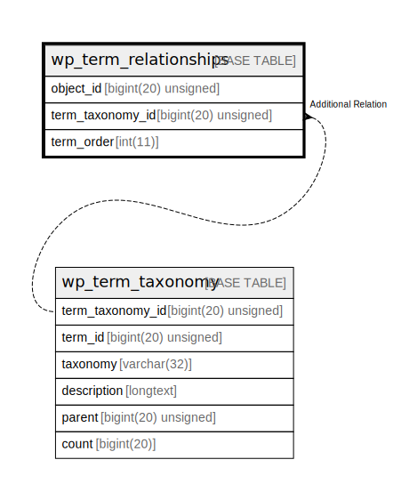

# wp_term_relationships

## 概要

<details>
<summary><strong>テーブル定義</strong></summary>

```sql
CREATE TABLE `wp_term_relationships` (
  `object_id` bigint(20) unsigned NOT NULL DEFAULT 0,
  `term_taxonomy_id` bigint(20) unsigned NOT NULL DEFAULT 0,
  `term_order` int(11) NOT NULL DEFAULT 0,
  PRIMARY KEY (`object_id`,`term_taxonomy_id`),
  KEY `term_taxonomy_id` (`term_taxonomy_id`)
) ENGINE=InnoDB DEFAULT CHARSET=utf8mb4 COLLATE=utf8mb4_unicode_520_ci
```

</details>

## カラム一覧

| 名前               | タイプ                 | デフォルト値       | NULL許可   | 子テーブル      | 親テーブル                                   | コメント     |
| ---------------- | ------------------- | ------------ | -------- | ---------- | --------------------------------------- | -------- |
| object_id        | bigint(20) unsigned | 0            | false    |            |                                         |          |
| term_taxonomy_id | bigint(20) unsigned | 0            | false    |            | [wp_term_taxonomy](wp_term_taxonomy.md) |          |
| term_order       | int(11)             | 0            | false    |            |                                         |          |

## 制約一覧

| 名前      | タイプ         | 定義                                        |
| ------- | ----------- | ----------------------------------------- |
| PRIMARY | PRIMARY KEY | PRIMARY KEY (object_id, term_taxonomy_id) |

## INDEX一覧

| 名前               | 定義                                                    |
| ---------------- | ----------------------------------------------------- |
| term_taxonomy_id | KEY term_taxonomy_id (term_taxonomy_id) USING BTREE   |
| PRIMARY          | PRIMARY KEY (object_id, term_taxonomy_id) USING BTREE |

## ER図



---

> Generated by [tbls](https://github.com/k1LoW/tbls)
