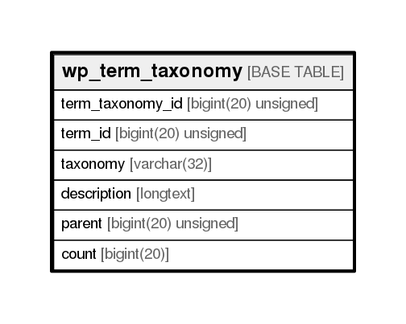

# wp_term_taxonomy

## Description

<details>
<summary><strong>Table Definition</strong></summary>

```sql
CREATE TABLE `wp_term_taxonomy` (
  `term_taxonomy_id` bigint(20) unsigned NOT NULL AUTO_INCREMENT,
  `term_id` bigint(20) unsigned NOT NULL DEFAULT '0',
  `taxonomy` varchar(32) COLLATE utf8mb4_unicode_ci NOT NULL DEFAULT '',
  `description` longtext COLLATE utf8mb4_unicode_ci NOT NULL,
  `parent` bigint(20) unsigned NOT NULL DEFAULT '0',
  `count` bigint(20) NOT NULL DEFAULT '0',
  PRIMARY KEY (`term_taxonomy_id`),
  UNIQUE KEY `term_id_taxonomy` (`term_id`,`taxonomy`),
  KEY `taxonomy` (`taxonomy`)
) ENGINE=InnoDB AUTO_INCREMENT=149 DEFAULT CHARSET=utf8mb4 COLLATE=utf8mb4_unicode_ci
```

</details>

## Columns

| Name             | Type                | Default | Nullable | Children | Parents | Comment |
| ---------------- | ------------------- | ------- | -------- | -------- | ------- | ------- |
| term_taxonomy_id | bigint(20) unsigned |         | false    |          |         |         |
| term_id          | bigint(20) unsigned | 0       | false    |          |         |         |
| taxonomy         | varchar(32)         |         | false    |          |         |         |
| description      | longtext            |         | false    |          |         |         |
| parent           | bigint(20) unsigned | 0       | false    |          |         |         |
| count            | bigint(20)          | 0       | false    |          |         |         |

## Constraints

| Name             | Type        | Definition                                      |
| ---------------- | ----------- | ----------------------------------------------- |
| PRIMARY          | PRIMARY KEY | PRIMARY KEY (term_taxonomy_id)                  |
| term_id_taxonomy | UNIQUE      | UNIQUE KEY term_id_taxonomy (term_id, taxonomy) |

## Indexes

| Name             | Definition                                                  |
| ---------------- | ----------------------------------------------------------- |
| taxonomy         | KEY taxonomy (taxonomy) USING BTREE                         |
| PRIMARY          | PRIMARY KEY (term_taxonomy_id) USING BTREE                  |
| term_id_taxonomy | UNIQUE KEY term_id_taxonomy (term_id, taxonomy) USING BTREE |

## Relations



---

> Generated by [tbls](https://github.com/k1LoW/tbls)
