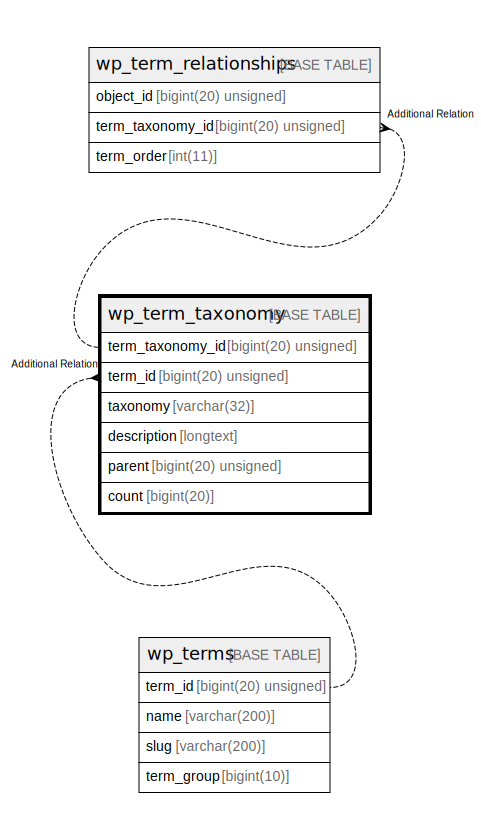

# wp_term_taxonomy

## 概要

<details>
<summary><strong>テーブル定義</strong></summary>

```sql
CREATE TABLE `wp_term_taxonomy` (
  `term_taxonomy_id` bigint(20) unsigned NOT NULL AUTO_INCREMENT,
  `term_id` bigint(20) unsigned NOT NULL DEFAULT 0,
  `taxonomy` varchar(32) COLLATE utf8mb4_unicode_520_ci NOT NULL DEFAULT '',
  `description` longtext COLLATE utf8mb4_unicode_520_ci NOT NULL,
  `parent` bigint(20) unsigned NOT NULL DEFAULT 0,
  `count` bigint(20) NOT NULL DEFAULT 0,
  PRIMARY KEY (`term_taxonomy_id`),
  UNIQUE KEY `term_id_taxonomy` (`term_id`,`taxonomy`),
  KEY `taxonomy` (`taxonomy`)
) ENGINE=InnoDB AUTO_INCREMENT=[Redacted by tbls] DEFAULT CHARSET=utf8mb4 COLLATE=utf8mb4_unicode_520_ci
```

</details>

## カラム一覧

| 名前               | タイプ                 | デフォルト値       | NULL許可   | Extra Definition | 子テーブル      | 親テーブル      | コメント     |
| ---------------- | ------------------- | ------------ | -------- | ---------------- | ---------- | ---------- | -------- |
| term_taxonomy_id | bigint(20) unsigned |              | false    | auto_increment   |            |            |          |
| term_id          | bigint(20) unsigned | 0            | false    |                  |            |            |          |
| taxonomy         | varchar(32)         | ''           | false    |                  |            |            |          |
| description      | longtext            |              | false    |                  |            |            |          |
| parent           | bigint(20) unsigned | 0            | false    |                  |            |            |          |
| count            | bigint(20)          | 0            | false    |                  |            |            |          |

## 制約一覧

| 名前               | タイプ         | 定義                                              |
| ---------------- | ----------- | ----------------------------------------------- |
| PRIMARY          | PRIMARY KEY | PRIMARY KEY (term_taxonomy_id)                  |
| term_id_taxonomy | UNIQUE      | UNIQUE KEY term_id_taxonomy (term_id, taxonomy) |

## INDEX一覧

| 名前               | 定義                                                          |
| ---------------- | ----------------------------------------------------------- |
| taxonomy         | KEY taxonomy (taxonomy) USING BTREE                         |
| PRIMARY          | PRIMARY KEY (term_taxonomy_id) USING BTREE                  |
| term_id_taxonomy | UNIQUE KEY term_id_taxonomy (term_id, taxonomy) USING BTREE |

## ER図



---

> Generated by [tbls](https://github.com/k1LoW/tbls)
