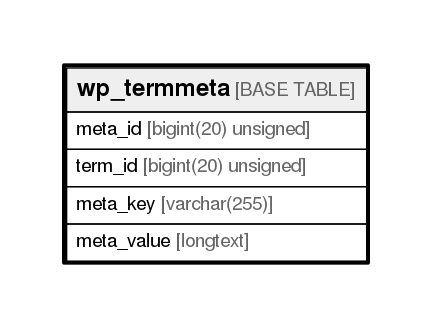

# wp_termmeta

## Description

<details>
<summary><strong>Table Definition</strong></summary>

```sql
CREATE TABLE `wp_termmeta` (
  `meta_id` bigint(20) unsigned NOT NULL AUTO_INCREMENT,
  `term_id` bigint(20) unsigned NOT NULL DEFAULT '0',
  `meta_key` varchar(255) COLLATE utf8mb4_unicode_ci DEFAULT NULL,
  `meta_value` longtext COLLATE utf8mb4_unicode_ci,
  PRIMARY KEY (`meta_id`),
  KEY `term_id` (`term_id`),
  KEY `meta_key` (`meta_key`(191))
) ENGINE=InnoDB DEFAULT CHARSET=utf8mb4 COLLATE=utf8mb4_unicode_ci
```

</details>

## Columns

| Name       | Type                | Default | Nullable | Children | Parents | Comment |
| ---------- | ------------------- | ------- | -------- | -------- | ------- | ------- |
| meta_id    | bigint(20) unsigned |         | false    |          |         |         |
| term_id    | bigint(20) unsigned | 0       | false    |          |         |         |
| meta_key   | varchar(255)        |         | true     |          |         |         |
| meta_value | longtext            |         | true     |          |         |         |

## Constraints

| Name    | Type        | Definition            |
| ------- | ----------- | --------------------- |
| PRIMARY | PRIMARY KEY | PRIMARY KEY (meta_id) |

## Indexes

| Name     | Definition                          |
| -------- | ----------------------------------- |
| meta_key | KEY meta_key (meta_key) USING BTREE |
| term_id  | KEY term_id (term_id) USING BTREE   |
| PRIMARY  | PRIMARY KEY (meta_id) USING BTREE   |

## Relations



---

> Generated by [tbls](https://github.com/k1LoW/tbls)
