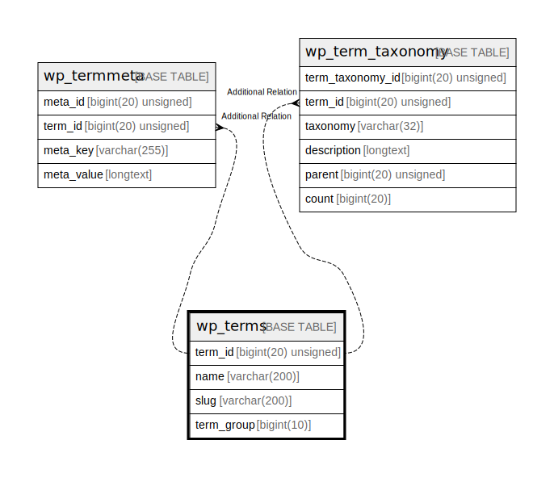

# wp_terms

## 概要

<details>
<summary><strong>テーブル定義</strong></summary>

```sql
CREATE TABLE `wp_terms` (
  `term_id` bigint(20) unsigned NOT NULL AUTO_INCREMENT,
  `name` varchar(200) NOT NULL DEFAULT '',
  `slug` varchar(200) NOT NULL DEFAULT '',
  `term_group` bigint(10) NOT NULL DEFAULT 0,
  PRIMARY KEY (`term_id`),
  KEY `slug` (`slug`(191)),
  KEY `name` (`name`(191))
) ENGINE=InnoDB AUTO_INCREMENT=[Redacted by tbls] DEFAULT CHARSET=utf8mb4 COLLATE=utf8mb4_unicode_520_ci
```

</details>

## カラム一覧

| 名前         | タイプ                 | デフォルト値       | NULL許可   | Extra Definition | 子テーブル                                                                 | 親テーブル      | コメント     |
| ---------- | ------------------- | ------------ | -------- | ---------------- | --------------------------------------------------------------------- | ---------- | -------- |
| term_id    | bigint(20) unsigned |              | false    | auto_increment   | [wp_termmeta](wp_termmeta.md) [wp_term_taxonomy](wp_term_taxonomy.md) |            |          |
| name       | varchar(200)        | ''           | false    |                  |                                                                       |            |          |
| slug       | varchar(200)        | ''           | false    |                  |                                                                       |            |          |
| term_group | bigint(10)          | 0            | false    |                  |                                                                       |            |          |

## 制約一覧

| 名前      | タイプ         | 定義                    |
| ------- | ----------- | --------------------- |
| PRIMARY | PRIMARY KEY | PRIMARY KEY (term_id) |

## INDEX一覧

| 名前      | 定義                                |
| ------- | --------------------------------- |
| name    | KEY name (name) USING BTREE       |
| slug    | KEY slug (slug) USING BTREE       |
| PRIMARY | PRIMARY KEY (term_id) USING BTREE |

## ER図



---

> Generated by [tbls](https://github.com/k1LoW/tbls)
