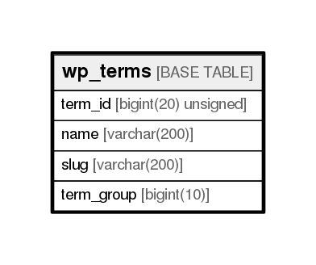

# wp_terms

## Description

<details>
<summary><strong>Table Definition</strong></summary>

```sql
CREATE TABLE `wp_terms` (
  `term_id` bigint(20) unsigned NOT NULL AUTO_INCREMENT,
  `name` varchar(200) COLLATE utf8mb4_unicode_ci NOT NULL DEFAULT '',
  `slug` varchar(200) COLLATE utf8mb4_unicode_ci NOT NULL DEFAULT '',
  `term_group` bigint(10) NOT NULL DEFAULT '0',
  PRIMARY KEY (`term_id`),
  KEY `slug` (`slug`(191)),
  KEY `name` (`name`(191))
) ENGINE=InnoDB AUTO_INCREMENT=149 DEFAULT CHARSET=utf8mb4 COLLATE=utf8mb4_unicode_ci
```

</details>

## Columns

| Name       | Type                | Default | Nullable | Children | Parents | Comment |
| ---------- | ------------------- | ------- | -------- | -------- | ------- | ------- |
| term_id    | bigint(20) unsigned |         | false    |          |         |         |
| name       | varchar(200)        |         | false    |          |         |         |
| slug       | varchar(200)        |         | false    |          |         |         |
| term_group | bigint(10)          | 0       | false    |          |         |         |

## Constraints

| Name    | Type        | Definition            |
| ------- | ----------- | --------------------- |
| PRIMARY | PRIMARY KEY | PRIMARY KEY (term_id) |

## Indexes

| Name    | Definition                        |
| ------- | --------------------------------- |
| name    | KEY name (name) USING BTREE       |
| slug    | KEY slug (slug) USING BTREE       |
| PRIMARY | PRIMARY KEY (term_id) USING BTREE |

## Relations



---

> Generated by [tbls](https://github.com/k1LoW/tbls)
