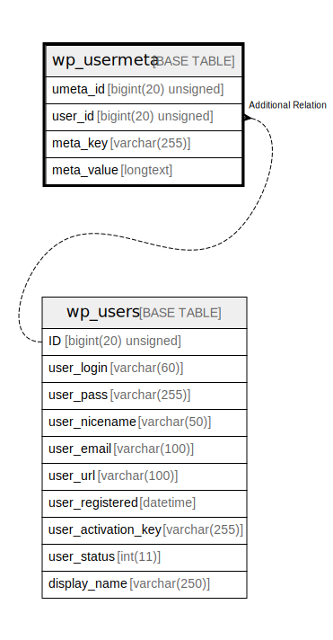

# wp_usermeta

## 概要

<details>
<summary><strong>テーブル定義</strong></summary>

```sql
CREATE TABLE `wp_usermeta` (
  `umeta_id` bigint(20) unsigned NOT NULL AUTO_INCREMENT,
  `user_id` bigint(20) unsigned NOT NULL DEFAULT 0,
  `meta_key` varchar(255) DEFAULT NULL,
  `meta_value` longtext DEFAULT NULL,
  PRIMARY KEY (`umeta_id`),
  KEY `user_id` (`user_id`),
  KEY `meta_key` (`meta_key`(191))
) ENGINE=InnoDB AUTO_INCREMENT=[Redacted by tbls] DEFAULT CHARSET=utf8mb4 COLLATE=utf8mb4_unicode_520_ci
```

</details>

## カラム一覧

| 名前         | タイプ                 | デフォルト値       | NULL許可   | Extra Definition | 子テーブル      | 親テーブル                   | コメント     |
| ---------- | ------------------- | ------------ | -------- | ---------------- | ---------- | ----------------------- | -------- |
| umeta_id   | bigint(20) unsigned |              | false    | auto_increment   |            |                         |          |
| user_id    | bigint(20) unsigned | 0            | false    |                  |            | [wp_users](wp_users.md) |          |
| meta_key   | varchar(255)        | NULL         | true     |                  |            |                         |          |
| meta_value | longtext            | NULL         | true     |                  |            |                         |          |

## 制約一覧

| 名前      | タイプ         | 定義                     |
| ------- | ----------- | ---------------------- |
| PRIMARY | PRIMARY KEY | PRIMARY KEY (umeta_id) |

## INDEX一覧

| 名前       | 定義                                  |
| -------- | ----------------------------------- |
| meta_key | KEY meta_key (meta_key) USING BTREE |
| user_id  | KEY user_id (user_id) USING BTREE   |
| PRIMARY  | PRIMARY KEY (umeta_id) USING BTREE  |

## ER図



---

> Generated by [tbls](https://github.com/k1LoW/tbls)
