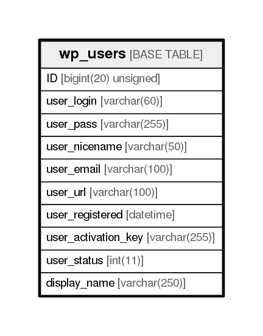

# wp_users

## Description

<details>
<summary><strong>Table Definition</strong></summary>

```sql
CREATE TABLE `wp_users` (
  `ID` bigint(20) unsigned NOT NULL AUTO_INCREMENT,
  `user_login` varchar(60) COLLATE utf8mb4_unicode_ci NOT NULL DEFAULT '',
  `user_pass` varchar(255) COLLATE utf8mb4_unicode_ci NOT NULL DEFAULT '',
  `user_nicename` varchar(50) COLLATE utf8mb4_unicode_ci NOT NULL DEFAULT '',
  `user_email` varchar(100) COLLATE utf8mb4_unicode_ci NOT NULL DEFAULT '',
  `user_url` varchar(100) COLLATE utf8mb4_unicode_ci NOT NULL DEFAULT '',
  `user_registered` datetime NOT NULL DEFAULT '0000-00-00 00:00:00',
  `user_activation_key` varchar(255) COLLATE utf8mb4_unicode_ci NOT NULL DEFAULT '',
  `user_status` int(11) NOT NULL DEFAULT '0',
  `display_name` varchar(250) COLLATE utf8mb4_unicode_ci NOT NULL DEFAULT '',
  PRIMARY KEY (`ID`),
  KEY `user_login_key` (`user_login`),
  KEY `user_nicename` (`user_nicename`),
  KEY `user_email` (`user_email`)
) ENGINE=InnoDB AUTO_INCREMENT=15 DEFAULT CHARSET=utf8mb4 COLLATE=utf8mb4_unicode_ci
```

</details>

## Columns

| Name                | Type                | Default             | Nullable | Children | Parents | Comment |
| ------------------- | ------------------- | ------------------- | -------- | -------- | ------- | ------- |
| ID                  | bigint(20) unsigned |                     | false    |          |         |         |
| user_login          | varchar(60)         |                     | false    |          |         |         |
| user_pass           | varchar(255)        |                     | false    |          |         |         |
| user_nicename       | varchar(50)         |                     | false    |          |         |         |
| user_email          | varchar(100)        |                     | false    |          |         |         |
| user_url            | varchar(100)        |                     | false    |          |         |         |
| user_registered     | datetime            | 0000-00-00 00:00:00 | false    |          |         |         |
| user_activation_key | varchar(255)        |                     | false    |          |         |         |
| user_status         | int(11)             | 0                   | false    |          |         |         |
| display_name        | varchar(250)        |                     | false    |          |         |         |

## Constraints

| Name    | Type        | Definition       |
| ------- | ----------- | ---------------- |
| PRIMARY | PRIMARY KEY | PRIMARY KEY (ID) |

## Indexes

| Name           | Definition                                    |
| -------------- | --------------------------------------------- |
| user_email     | KEY user_email (user_email) USING BTREE       |
| user_login_key | KEY user_login_key (user_login) USING BTREE   |
| user_nicename  | KEY user_nicename (user_nicename) USING BTREE |
| PRIMARY        | PRIMARY KEY (ID) USING BTREE                  |

## Relations



---

> Generated by [tbls](https://github.com/k1LoW/tbls)
