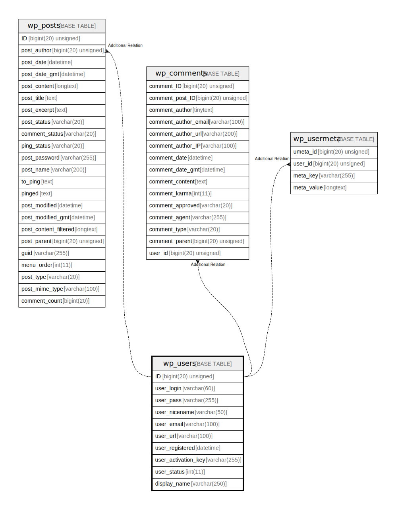

# wp_users

## 概要

<details>
<summary><strong>テーブル定義</strong></summary>

```sql
CREATE TABLE `wp_users` (
  `ID` bigint(20) unsigned NOT NULL AUTO_INCREMENT,
  `user_login` varchar(60) COLLATE utf8mb4_unicode_520_ci NOT NULL DEFAULT '',
  `user_pass` varchar(255) COLLATE utf8mb4_unicode_520_ci NOT NULL DEFAULT '',
  `user_nicename` varchar(50) COLLATE utf8mb4_unicode_520_ci NOT NULL DEFAULT '',
  `user_email` varchar(100) COLLATE utf8mb4_unicode_520_ci NOT NULL DEFAULT '',
  `user_url` varchar(100) COLLATE utf8mb4_unicode_520_ci NOT NULL DEFAULT '',
  `user_registered` datetime NOT NULL DEFAULT '0000-00-00 00:00:00',
  `user_activation_key` varchar(255) COLLATE utf8mb4_unicode_520_ci NOT NULL DEFAULT '',
  `user_status` int(11) NOT NULL DEFAULT 0,
  `display_name` varchar(250) COLLATE utf8mb4_unicode_520_ci NOT NULL DEFAULT '',
  PRIMARY KEY (`ID`),
  KEY `user_login_key` (`user_login`),
  KEY `user_nicename` (`user_nicename`),
  KEY `user_email` (`user_email`)
) ENGINE=InnoDB AUTO_INCREMENT=[Redacted by tbls] DEFAULT CHARSET=utf8mb4 COLLATE=utf8mb4_unicode_520_ci
```

</details>

## カラム一覧

| 名前                  | タイプ                 | デフォルト値                | NULL許可   | Extra Definition | 子テーブル      | 親テーブル      | コメント     |
| ------------------- | ------------------- | --------------------- | -------- | ---------------- | ---------- | ---------- | -------- |
| ID                  | bigint(20) unsigned |                       | false    | auto_increment   |            |            |          |
| user_login          | varchar(60)         | ''                    | false    |                  |            |            |          |
| user_pass           | varchar(255)        | ''                    | false    |                  |            |            |          |
| user_nicename       | varchar(50)         | ''                    | false    |                  |            |            |          |
| user_email          | varchar(100)        | ''                    | false    |                  |            |            |          |
| user_url            | varchar(100)        | ''                    | false    |                  |            |            |          |
| user_registered     | datetime            | '0000-00-00 00:00:00' | false    |                  |            |            |          |
| user_activation_key | varchar(255)        | ''                    | false    |                  |            |            |          |
| user_status         | int(11)             | 0                     | false    |                  |            |            |          |
| display_name        | varchar(250)        | ''                    | false    |                  |            |            |          |

## 制約一覧

| 名前      | タイプ         | 定義               |
| ------- | ----------- | ---------------- |
| PRIMARY | PRIMARY KEY | PRIMARY KEY (ID) |

## INDEX一覧

| 名前             | 定義                                            |
| -------------- | --------------------------------------------- |
| user_email     | KEY user_email (user_email) USING BTREE       |
| user_login_key | KEY user_login_key (user_login) USING BTREE   |
| user_nicename  | KEY user_nicename (user_nicename) USING BTREE |
| PRIMARY        | PRIMARY KEY (ID) USING BTREE                  |

## ER図



---

> Generated by [tbls](https://github.com/k1LoW/tbls)
